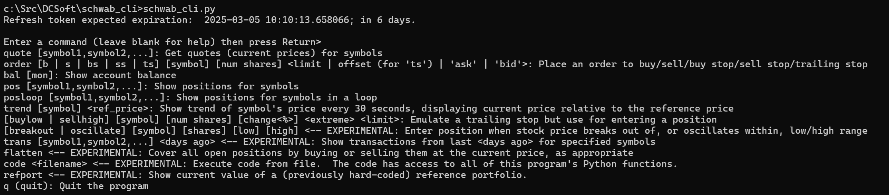
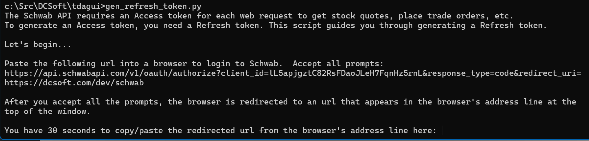

# Schwab_CLI

## What it is

Here are several Python scripts to provide CLI access to your Schwab (formerly TD Ameritrade) brokerage account.  The necessary Schwab token management is broken out into re-usable modules you can use in other software.

## Command-line access to your Schwab account

[_schwab_cli.py_]

A command-line playground for Python access to Schwab brokerage accounts.  Includes commands to:

* Quote equities
* Buy/sell equities (either on-demand or when specified price conditions occur)
* View currently held positions
* Summarize daily transactions 

The simplest command is "quote".  To get a quote on Apple, type

> \> quote aapl
> 
>Refreshing access token...  
> {'symbol': 'AAPL', 'last': 229.499, 'ask': 229.55, 'bid': 229.47}

TODO:  Write documentation on other commands and in-progress modules _orders.py_ and _transactions.py_

## Token Access

[_schwab_auth.py_]

Re-usable module used by _schwab_cli.py_ to provide -- and to re-generate as needed -- the Access token required to call the Schwab API.

The current token state is saved in _auth.json_.

## Refresh Token Generation

[_gen_refresh_token.py_]

Standalone CLI utility that generates a Refresh token, which is then used to create Access Tokens.

The current token state is saved in _auth.json_.

## Schwab Account requirements

Your Schwab account must be made available for API access to these scripts (and any other software you develop).  See https://developer.schwab.com/user-guides/

Specifically, these scripts require the following data specific to your Schwab account.

[_.env.example_]
* SCHWAB_APP_KEY=lL5apjgztC82RsFDaoJLeH7FqnHz5rnL
* SCHWAB_APP_SECRET=3gWeqCR7qDPeG1FD
* SCHWAB_CALLBACK_URL=https://dcsoft.com/dev/schwab

**Create a file named "_.env_"** like the above example, but change the values to the ones specific to your Schwab account.
