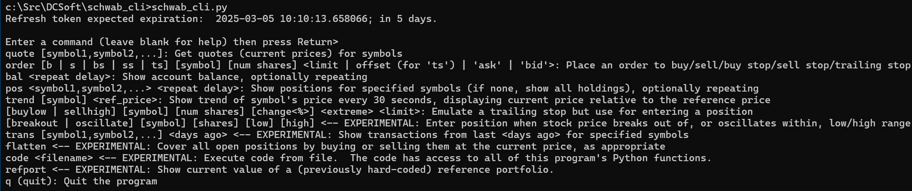

# Schwab_CLI

## What it is

Here are several Python scripts to provide CLI access to your Schwab (formerly TD Ameritrade) brokerage account.  The necessary Schwab token management is broken out into re-usable modules you can use in other software.

## Command-line access to your Schwab account

[_schwab_cli.py_]

**Status:  Production** for documented commands below, **Experimental** for undocumented commands

A command-line playground for Python access to Schwab brokerage accounts.  Includes commands to:

* Quote equities
* View currently held positions
* Buy/sell equities (either on-demand or when specified price conditions occur)
* Summarize daily transactions 

### Commands

#### Quote

quote [symbol1,symbol2,...]

> To get a quote on Apple, type  
> \> quote aapl  
> {'symbol': 'AAPL', 'last': 229.499, 'ask': 229.55, 'bid': 229.47}

#### Position

pos [symbol1,symbol2,...]

> To see current position on Reddit, type 
> \> pos rddt 
RDDT: 30 @ 176.566666666667 (201.09); gain/loss: 735.70

#### Buying and Selling

[b<uy> | s<ell> | bs | ss | ts] [symbol] [num shares] <limit | offset | 'ask' | 'bid'>

> To buy 100 shares of Apple at the market price:  
> \> b aapl 100  
>  
> To buy 100 shares of Apple at $213.50/share:  
> \> b aapl 100 213.50  
>  
> To buy 100 shares of Apple at the bidding (highest buying offer) price:  
> \> b aapl 100 bid  
>  
> To sell 100 shares of Apple at the asking (lowest selling offer) price:  
> \> s aapl 100 ask  

`bs` is "buy stop"  
`ss` is "sell stop"  
`ts` is "trailing stop"

#### Support Modules
[_schwab_orders.py_] 
[_schwab_transactions.py_]

## Token Access
**Status:  Production**

[_schwab_auth.py_]

Re-usable module used by _schwab_cli.py_ to provide -- and to re-generate as needed -- the Access token required to call the Schwab API.

The current token state is saved in _auth.json_.

## Refresh Token Generation
**Status:  Production**

[_gen_refresh_token.py_]

Standalone CLI utility that generates a Refresh token, which is then used to create Access Tokens.

The current token state is saved in _auth.json_.

## Schwab Account requirements

Your Schwab account must be made available for API access to these scripts (and any other software you develop).  See https://developer.schwab.com/user-guides/

Specifically, these scripts require the following data specific to your Schwab account.

[_.env.example_]
* SCHWAB_APP_KEY=lL5apjgztC82RsFDaoJLeH7FqnHz5rnL
* SCHWAB_APP_SECRET=3gWeqCR7qDPeG1FD
* SCHWAB_CALLBACK_URL=https://dcsoft.com/dev/schwab

**Create a file named "_.env_"** like the above example, but change the values to the ones specific to your Schwab account.
